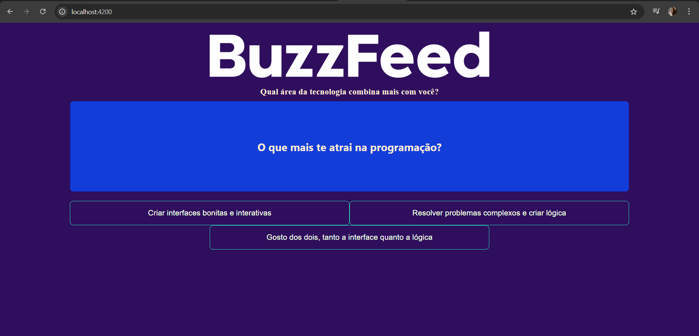
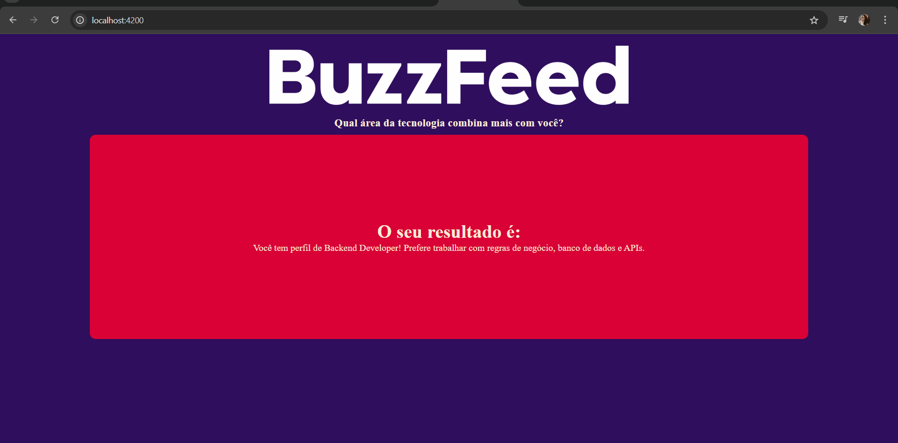
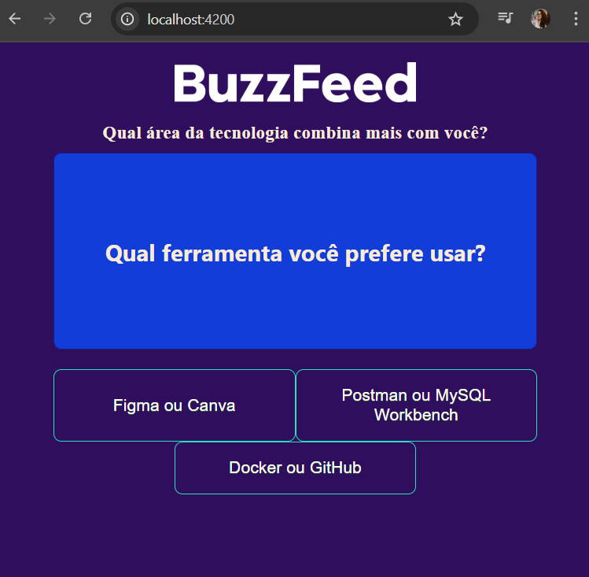
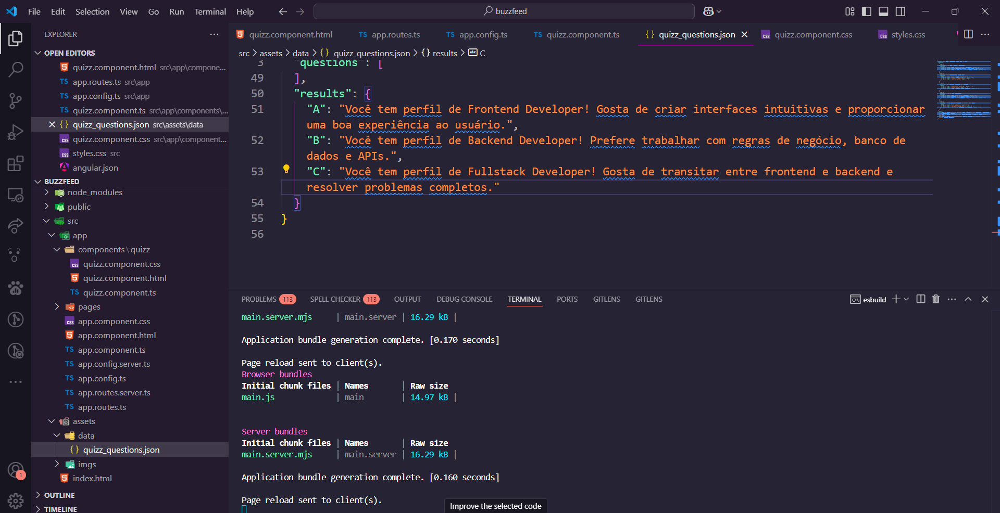

# 🎮 Jogo Interativo "Buzzfeed Quiz"

Este projeto acadêmico consiste na construção de um **jogo interativo** do estilo **Buzzfeed Quiz** utilizando **Angular**, **TypeScript**, **HTML** e **CSS**. O objetivo principal foi desenvolver uma dinâmica de jogo simples e responsiva, onde o usuário responde a perguntas para obter um resultado baseado em suas escolhas.

## 🚀 Tecnologias Utilizadas

As tecnologias e ferramentas utilizadas no projeto incluem:

  
  
  
  

## 🎯 Funcionalidades do Jogo

O jogo consiste em um quiz dinâmico, com perguntas e opções de resposta para o usuário escolher. A lógica do jogo foi desenvolvida utilizando **dados locais**, sem a utilização de uma API. O foco do projeto foi na implementação da lógica do quiz, com ênfase na **responsividade** para garantir que o jogo funcione bem em diferentes dispositivos.

## ✨ Pontos Importantes

Este projeto foi realizado no contexto acadêmico, com a estrutura básica fornecida pelo professor. A lógica do jogo foi seguida conforme a proposta, mas tomei a liberdade de **personalizar o estilo**, ajustando as **cores** e o layout para criar uma experiência visualmente mais agradável e que combinasse mais comigo. Essas pequenas mudanças, embora simples, me permitiram aprender e aplicar conceitos de estilização de forma prática, o que considero uma grande conquista.

Conseguir **deixar o projeto executável** e funcional com a lógica proposta, mesmo sem grandes alterações na estrutura, foi um passo importante para consolidar o aprendizado.

Além disso, ao longo do desenvolvimento, enfrentei alguns desafios técnicos, como o uso do `*ngIf`. Inicialmente, o comando `*ngIf=!fisnished` não funcionou corretamente, e após algumas pesquisas e com a ajuda do **ChatGPT**, consegui ajustar para `ngIf="!fisnished"`. Essa solução foi fundamental para o funcionamento correto da lógica do jogo.

## 📈 Melhorias Futuras

Embora o projeto atual não envolva integração com APIs, algumas melhorias planejadas para o futuro incluem:

- **Conectar o jogo a uma API**: Isso permitirá que os dados sejam dinâmicos, como carregar novas perguntas e resultados personalizados.
- **Hospedar o site**: Tornar o jogo acessível online, para que outras pessoas possam jogar.
- **Adicionar mais interatividade e animações**: Melhorar a experiência do usuário com transições mais fluidas e animações.

## 📷 Imagens do Projeto

    
    
    
    

